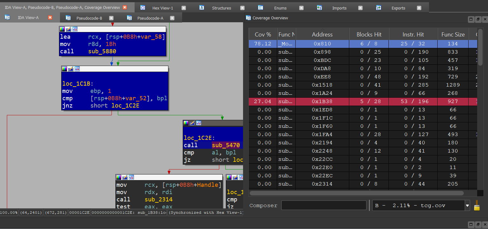

### Overview



The code coverage framework is capable of collecting code coverage information from targets running under Qiling Framework. Afterwards, the results can be serialized into a format suitable for further processing or manual viewing.
By leveraging the code coverage framework, one can know exactly which parts of the emulated code were executed and which weren't. Needless to say, this is an invaluable ability and can greatly aid any security-oriented research in couple of domains such as general RE, vulnerability research, exploit development, etc.

### Command-line interface

The command-line interface for controlling code coverage is comprise of two new switches in `qltool`:

- `-c, --coverage-file`: Specifies the name of the output coverage file. This file can later be imported by coverage visualization tools such as [Lighthouse](https://github.com/gaasedelen/lighthouse) in order to visualize the trace:
- `--coverage-format`: Specifies the format of the coverage file. Currently only the `drcov` format is supported. If you wish to add support for additional formats, please read the relevant section.

```bash
./qltool run -f examples/rootfs/x8664_efi/bin/TcgPlatformSetupPolicy --rootfs examples/rootfs/x8664_efi --coverage-format drcov --coverage-file TcgPlatformSetupPolicy.cov
```

### Extending the framework to support additional coverage formats

Currently, the framework is only capable of omitting code coverage files which comform to the 'drcov' format used by the DynamoRIO [tool of the same name](https://dynamorio.org/dynamorio_docs/page_drcov.html).
If you wish to extend the framework by adding support for new coverage formats, please follow these steps:

- Create a new source module under the `coverage\formats` directory.
- Make the new format "discoverable" by adding its name to the `__all__` list in `coverage\__init__.py`
- Create a new class which inherits from `QlBaseCoverage`.
- Implement all base class methods which are marked with the `@abstractmethod` decorator:
  - `FORMAT_NAME`: a user-friendly name for the coverage format name. This name will be presented in the help message of `qltool` as one of the possible choices for a coverage format.
  - `def activate(self)`: Starts code coverage collection, for example by registering a new basic block callback.
  - `def deactivate(self)`: Stops code coverage collection, for example by de-registering the aforementioned basic block callback.
  - `def dump_coverage(self, coverage_file)`: Should open the file specified in `coverage_file` and then write all the collected coverage information into it. Usually the coverage format will dictate some fixed-size headers, followed by a variable-length list of the individual basic blocks which were encountered during emulation.
