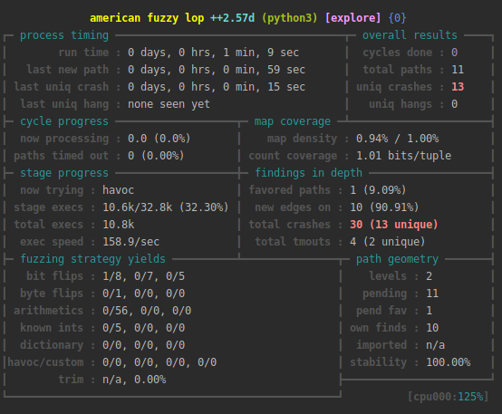
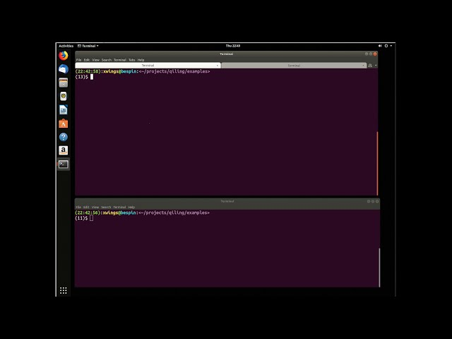
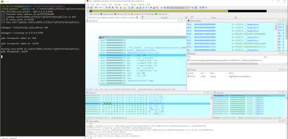

### Emulating a Windows EXE on a Linux machine.

Using Qiling Framework to emulate a Windows binary on a Linux machine.

Example code
```python
from qiling import *

# sandbox to emulate the EXE
def my_sandbox(path, rootfs):
    # setup Qiling engine
    ql = Qiling(path, rootfs)
    # now emulate the EXE
    ql.run()

if __name__ == "__main__":
    # execute Windows EXE under our rootfs
    my_sandbox(["examples/rootfs/x86_windows/bin/x86_hello.exe"], "examples/rootfs/x86_windows")
```


### Emulating Windows Registry
Emulating Windows registry with Qiling Framework

Example code
```python
import sys
sys.path.append("..")
from qiling import *
from qiling.const import QL_VERBOSE

def my_sandbox(path, rootfs):
    ql = Qiling(path, rootfs, verbose=QL_VERBOSE.DEBUG)
    ql.run()


if __name__ == "__main__":
    my_sandbox(["rootfs/x86_windows/bin/RegDemo.exe"], "rootfs/x86_windows")
```

Youtube video

[](https://www.youtube.com/watch?v=4nk8KNgbNzw)


### Catching Wannacry's killer swtich

This demo executed wannacry.bin (md5 41b5ba4bf74e65845fa8c9861ca34508) and look for the killerswitch url

Example code
```python
import sys
sys.path.append("..")
from qiling import *
from qiling.const import QL_VERBOSE

def stopatkillerswtich(ql):
    print("killerswtch found")
    ql.emu_stop()

if __name__ == "__main__":
    ql = Qiling(["rootfs/x86_windows/bin/wannacry.bin"], "rootfs/x86_windows", verbose=QL_VERBOSE.DEBUG)
    ql.hook_address(stopatkillerswtich, 0x40819a)
    ql.run()
```

Youtube video

[](https://www.youtube.com/watch?v=gVtpcXBxwE8)


### Dynamically patch a Windows crackme, make it always displays "Congratulation" dialog.

Using Qiling Framework to dynamically patch a Windows Crackme and making it always displays "Congratulation" dialog.

Example code
```python
from qiling import *

def force_call_dialog_func(ql):
    # get DialogFunc address
    lpDialogFunc = ql.unpack32(ql.mem.read(ql.reg.esp - 0x8, 4))
    # setup stack memory for DialogFunc

    ql.stack_push(0)
    ql.stack_push(1001)
    ql.stack_push(273)
    ql.stack_push(0)
    ql.stack_push(0x0401018)
    # force EIP to DialogFunc
    ql.reg.eip = lpDialogFunc


def my_sandbox(path, rootfs):
    ql = Qiling(path, rootfs)
    # NOP out some code
    ql.patch(0x004010B5, b'\x90\x90')
    ql.patch(0x004010CD, b'\x90\x90')
    ql.patch(0x0040110B, b'\x90\x90')
    ql.patch(0x00401112, b'\x90\x90')
    # hook at an address with a callback
    ql.hook_address(force_call_dialog_func, 0x00401016)
    ql.run()


if __name__ == "__main__":
    my_sandbox(["rootfs/x86_windows/bin/Easy_CrackMe.exe"], "rootfs/x86_windows")
```

Youtube video

[](https://www.youtube.com/watch?v=p17ONUbCnUU "Video DEMO 2")


### GDBserver with IDAPro

Solving a simple CTF challenge with Qiling Framework and IDAPro

Youtube video

[](https://www.youtube.com/watch?v=SPjVAt2FkKA "Video DEMO 2")


### Solving malformed ELF header + Anti-Debug crackme, with Qiling GDBserver + Qiling qltool

Youtube video

[](https://www.youtube.com/watch?v=TYGZ-GVRIaA)


### Fuzzing with Qiling Unicornafl

More information on fuzzing with Qiling Unicornafl can be found [here](https://github.com/qilingframework/qiling/tree/dev/examples/fuzzing/README.md).

Example code
```python
import unicornafl

# Make sure Qiling uses our patched unicorn instead of it's own, second so without instrumentation!
unicornafl.monkeypatch()

import sys, os
from binascii import hexlify

from capstone.x86_const import *

sys.path.append("../..")
from qiling import *

# we cache this for some extra speed
stdin_fstat = os.fstat(sys.stdin.fileno())

# This is mostly taken from the crackmes
class MyPipe():
    def __init__(self):
        self.buf = b''

    def write(self, s):
        self.buf += s

    def read(self, size):
        if size <= len(self.buf):
            ret = self.buf[: size]
            self.buf = self.buf[size:]
        else:
            ret = self.buf
            self.buf = ''
        return ret

    def fileno(self):
        return 0

    def show(self):
        pass

    def clear(self):
        pass

    def flush(self):
        pass

    def close(self):
        self.outpipe.close()

    def fstat(self):
        return stdin_fstat


def main(input_file, enable_trace=False):
    stdin = MyPipe()
    ql = Qiling(["./x8664_fuzz"], "../rootfs/x8664_linux",
                stdin=stdin,
                stdout=1 if enable_trace else None,
                stderr=1 if enable_trace else None,
                console = True if enable_trace else False)

    # or this for output:
    # ... stdout=sys.stdout, stderr=sys.stderr)

    def place_input_callback(uc, input, _, data):
        stdin.write(input)

    def start_afl(_ql: Qiling):
        """
        Callback from inside
        """
        # We start our AFL forkserver or run once if AFL is not available.
        # This will only return after the fuzzing stopped.
        try:
            #print("Starting afl_fuzz().")
            if not _ql.uc.afl_fuzz(input_file=input_file,
                        place_input_callback=place_input_callback,
                        exits=[ql.os.exit_point]):
                print("Ran once without AFL attached.")
                os._exit(0)  # that's a looot faster than tidying up.
        except unicornafl.UcAflError as ex:
            # This hook trigers more than once in this example.
            # If this is the exception cause, we don't care.
            # TODO: Chose a better hook position :)
            if ex != unicornafl.UC_AFL_RET_CALLED_TWICE:
                raise
    
    # 64 bit loader addrs are placed at 0x7ffbf0100000
    # see loader/elf.py:load_with_ld(..)
    X64BASE = int(ql.profile.get("OS64", "load_address"),16)
    
    # crash in case we reach stackcheck_fail:
    # 1225:	e8 16 fe ff ff       	callq  1040 <__stack_chk_fail@plt>
    ql.hook_address(callback=lambda x: os.abort(), address=X64BASE + 0x1225)

    # Add hook at main() that will fork Unicorn and start instrumentation.
    # main starts at X64BASE + 0x122c
    main_addr = X64BASE + 0x122c
    ql.hook_address(callback=start_afl, address=main_addr)

    if enable_trace:
        # The following lines are only for `-t` debug output

        md = Cs(CS_ARCH_X86, CS_MODE_64)
        count = [0]

        def spaced_hex(data):
            return b' '.join(hexlify(data)[i:i+2] for i in range(0, len(hexlify(data)), 2)).decode('utf-8')

        def disasm(count, ql, address, size):
            buf = ql.mem.read(address, size)
            try:
                for i in md.disasm(buf, address):
                    return "{:08X}\t{:08X}: {:24s} {:10s} {:16s}".format(count[0], i.address, spaced_hex(buf), i.mnemonic,
                                                                        i.op_str)
            except:
                import traceback
                print(traceback.format_exc())

        def trace_cb(ql, address, size, count):
            rtn = '{:100s}'.format(disasm(count, ql, address, size))
            print(rtn)
            count[0] += 1

        ql.hook_code(trace_cb, count)

    # okay, ready to roll.
    # try:
    ql.run()
    # except Exception as ex:
    #     # Probable unicorn memory error. Treat as crash.
    #     print(ex)
    #     os.abort()

    os._exit(0)  # that's a looot faster than tidying up.


if __name__ == "__main__":
    if len(sys.argv) == 1:
        raise ValueError("No input file provided.")
    if len(sys.argv) > 2 and sys.argv[1] == "-t":
        main(sys.argv[2], enable_trace=True)
    else:
        main(sys.argv[1])
```


Screenshot

[](https://github.com/qilingframework/qiling/blob/master/examples/fuzzing/linux_x8664/qilingfzz.png "Demo #2 Fuzzing with Qiling Unicornafl")


### Emulating Netgear R6220

Almost a complete emulation of Netgear R6220, a 32bit MIPS based router runs on a x86 64bit Ubuntu.

Example code

```python
import sys
sys.path.append("..")
from qiling import *
from qiling.os.posix import syscall
from qiling.const import QL_VERBOSE

def my_syscall_write(ql, write_fd, write_buf, write_count, *rest):
    if write_fd == 2 and ql.os.file_des[2].__class__.__name__ == 'ql_pipe':
        ql.os.definesyscall_return(-1)
    else:
        syscall.ql_syscall_write(ql, write_fd, write_buf, write_count, *rest)


def my_netgear(path, rootfs):
    ql = Qiling(
                path, 
                rootfs, 
                verbose      = QL_VERBOSE.DEBUG, 
                profile     = "netgear_6220.ql"
                )

    ql.root             = False
    ql.bindtolocalhost  = True
    ql.multithread      = False
    ql.add_fs_mapper('/proc', '/proc')
    ql.set_syscall(4004, my_syscall_write)
    ql.run()


if __name__ == "__main__":
    my_netgear(["rootfs/netgear_r6220/bin/mini_httpd",
                "-d","/www",
                "-r","NETGEAR R6220",
                "-c","**.cgi",
                "-t","300"], 
                "rootfs/netgear_r6220")
```

Youtube video

[](https://www.youtube.com/watch?v=fGncO4sVCnY)


### Emulating ARM router firmware on Ubuntu X64 machine

Qiling Framework hot-patches and emulates ARM router's httpd on a X86_64Bit Ubuntu

Example code
```python
import os, socket, sys, threading
sys.path.append("..")
from qiling import *
from qiling.const import QL_VERBOSE

def patcher(ql):
    br0_addr = ql.mem.search("br0".encode() + b'\x00')
    for addr in br0_addr:
        ql.mem.write(addr, b'lo\x00')

def nvram_listener():
    server_address = 'rootfs/var/cfm_socket'
    data = ""
    
    try:  
        os.unlink(server_address)  
    except OSError:  
        if os.path.exists(server_address):  
            raise  

    # Create UDS socket  
    sock = socket.socket(socket.AF_UNIX,socket.SOCK_STREAM)  
    sock.bind(server_address)  
    sock.listen(1)  
  
    while True:  
        connection, client_address = sock.accept()  
        try:  
            while True:  
                data += str(connection.recv(1024))
        
                if "lan.webiplansslen" in data:  
                    connection.send('192.168.170.169'.encode())  
                elif "wan_ifname" in data:
                    connection.send('eth0'.encode())
                elif "wan_ifnames" in data:
                    connection.send('eth0'.encode())
                elif "wan0_ifname" in data:
                    connection.send('eth0'.encode())
                elif "wan0_ifnames" in data:
                    connection.send('eth0'.encode())
                elif "sys.workmode" in data:
                    connection.send('bridge'.encode())
                elif "wan1.ip" in data:
                    connection.send('1.1.1.1'.encode())
                else: 
                    break  
                data = ""
        finally:  
                connection.close() 

def my_sandbox(path, rootfs):
    ql = Qiling(path, rootfs, verbose=QL_VERBOSE.DEBUG)
    ql.add_fs_mapper("/dev/urandom","/dev/urandom")
    ql.hook_address(patcher ,ql.loader.elf_entry)
    ql.run()


if __name__ == "__main__":
    nvram_listener_therad =  threading.Thread(target=nvram_listener, daemon=True)
    nvram_listener_therad.start()
    my_sandbox(["rootfs/bin/httpd"], "rootfs")
```

Youtube video

[](https://www.youtube.com/watch?v=Nxu742-SNvw "Demo #3 Emulating ARM router firmware on Ubuntu X64 machine")


### Emulating UEFI

Qiling Framework emulates UEFI

```python
import sys
import pickle
sys.path.append("..")
from qiling import *
from qiling.os.uefi.const import *

def force_notify_RegisterProtocolNotify(ql, address, params):
    event_id = params['Event']
    if event_id in ql.loader.events:
        ql.loader.events[event_id]['Guid'] = params["Protocol"]
        # let's force notify
        event = ql.loader.events[event_id]
        event["Set"] = True
        ql.loader.notify_list.append((event_id, event['NotifyFunction'], event['NotifyContext']))
        ######
        return EFI_SUCCESS
    return EFI_INVALID_PARAMETER


if __name__ == "__main__":
    with open("rootfs/x8664_efi/rom2_nvar.pickel", 'rb') as f:
        env = pickle.load(f)
    ql = Qiling(["rootfs/x8664_efi/bin/TcgPlatformSetupPolicy"], "rootfs/x8664_efi", env=env)
    ql.set_api("hook_RegisterProtocolNotify", force_notify_RegisterProtocolNotify)
    ql.run()
```

Screenshot

[](https://github.com/qilingframework/rtfd.io/blob/master/docs/img/demo4-en.png "Demo #4 Emulating UEFI")
