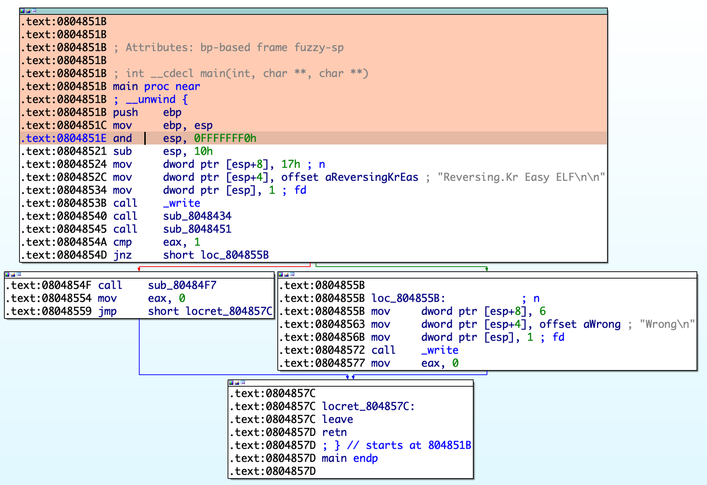
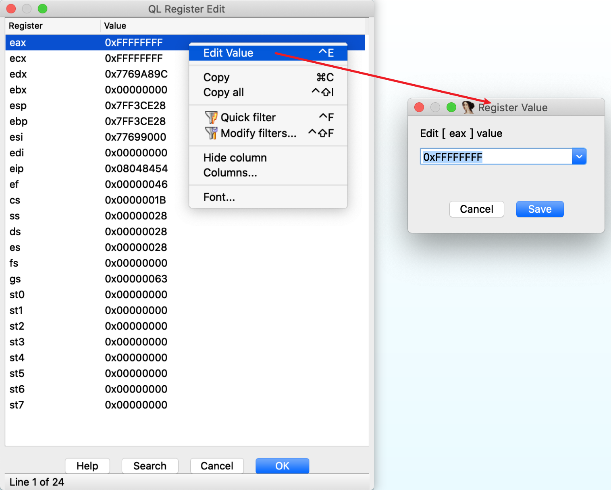

### Install
- There are Two ways to install Qiling's IDA Plugin

>- Put the plugin file in IDA Pro\plugins and open IDA, it will auto load.
>- Open plugin file, change `UseAsScript = True`. Open IDA, Click `File/Script file...`, choose plugin file, it will load.

This plugin support IDA7.x

### Usage
After load the plugin, click on the right will show Qiling Emulator pop-up menu.


### Emulate

**Must Click Setup First**

Select rootfs path and click Start(input custom script path if you have).

If the custom script is loaded successfully, it will prompt 'User Script Load'.Otherwise, it will prompt 'There Is No User Scripts', please check the script path and syntax are correct.


Now if you click `Continue`, Qiling will emulate the target from start(entry_point) to finish(exit_point) and paint the path green.


if you want to start over, click `Restart`, it will clear the previous color and ask rootfs path again, then we back to the start.

Now try something new, we want to let Qiling stop at 0x0804851E.


Just move the mouse pointer to position 0x0804851E and click right, select `Execute Till`, Qiling will emulate to 0x0804851E(if the path is reachable), and paint the address nude.



we can watch Register and Stack by click `View Register`, `View Stack`.


we can watch Memory by click `View Memory`.
Input address and size of memory you want to access.
It will show if this address can be access.


Click `Step` or use `CTRL+SHIFT+F9` can let Qiling emulator step in and paint the path blue. 

**You can see 'Register View' and 'Stack View' are real-time**


Now we are in 0x0804852C. Let's enter the function sub_8048451 and click `F2` to setup a breakpoint at 0x08048454. 


click `Continue`, it will emulate until program exit or stop when a breakpoint is triggered and paint the path green.


Want to change some register values? Right click on Disassemble View or Register View and select `Edit Register`, right click on which register you want to change, then select `Edit Value` to change it.



### Write custom scripts

custom scripts is a python script, the code frame like this:

```python
from qiling import *

class QILING_IDA():
    def __init__(self):
        pass

    def custom_continue(self, ql:Qiling):
        hook = []
        return hook

    def custom_step(self, ql:Qiling):
        hook = []
        return hook
```

As the functions name means, you can code in function and it will run when you click `Continue` or `Step`. So the cool thing is you can add you own hook.(if you code need't use hook, keep `hook = []`)

To load custom script, please click Setup and input rootfs path and custom script path.

This is a example at qiling/extensions/idaplugin/examples/custom_script.py
```python
from qiling import *


class QILING_IDA():
    def __init__(self):
        pass

    def custom_continue(self, ql:Qiling):
        def continue_hook(ql, addr, size):
            print(hex(addr))

        print('user continue hook')
        hook = []
        hook.append(ql.hook_code(continue_hook))
        return hook

    def custom_step(self, ql:Qiling, stepflag):
        def step_hook1(ql, addr, size, stepflag):
            if stepflag:
                stepflag = not stepflag
                print(hex(addr))

        def step_hook2(ql):
            print('arrive to 0x0804845B')

        print('user step hook')
        hook = []
        hook.append(ql.hook_code(step_hook1, user_data=stepflag))
        hook.append(ql.hook_address(step_hook2, 0x0804845B))
        return hook
```

Execute Till 0x08048452 and try to Step, custom_step hook will show.


Set breakpoint at 0x080484F6 and click `Continue`, custom_continue hook will show.


**Change the custom script and want to take effect immediately?**
Just save the script and click `Reload User Scripts`. If reload success, it will show 'User Script Reload'.

### Save and Load Snapshot
you can save current status(Register, Memory, CPU Context) and load it to your Qiling emulate script or new Qiling Emulator Plugin, just click `Save Snapshot`
or `Load Snapshot`.

For saving, you should select the path where you want to store and file name.


For restoring, you should select where the status saving file is.


