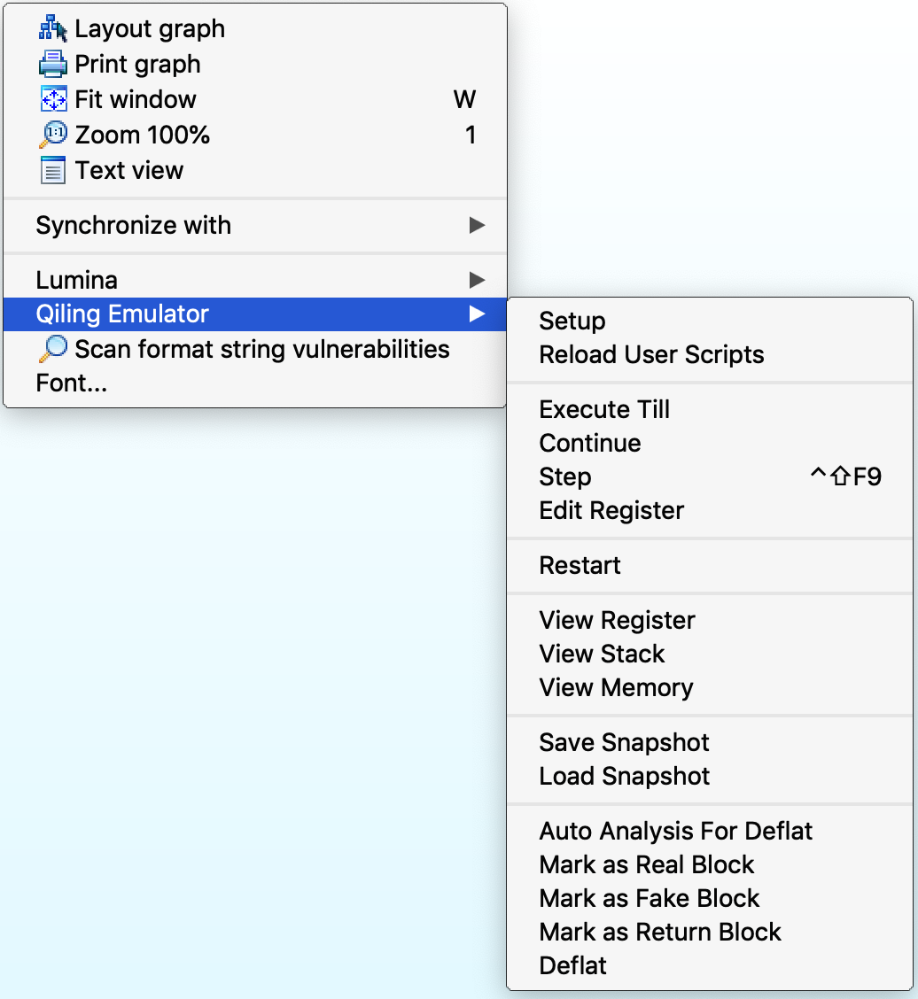
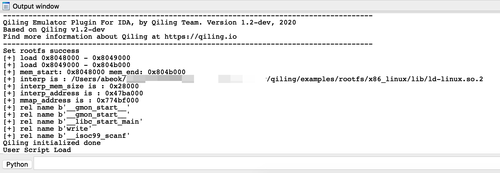
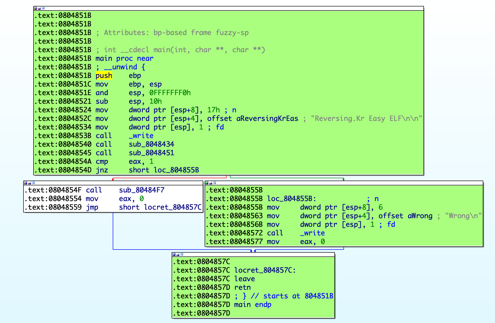
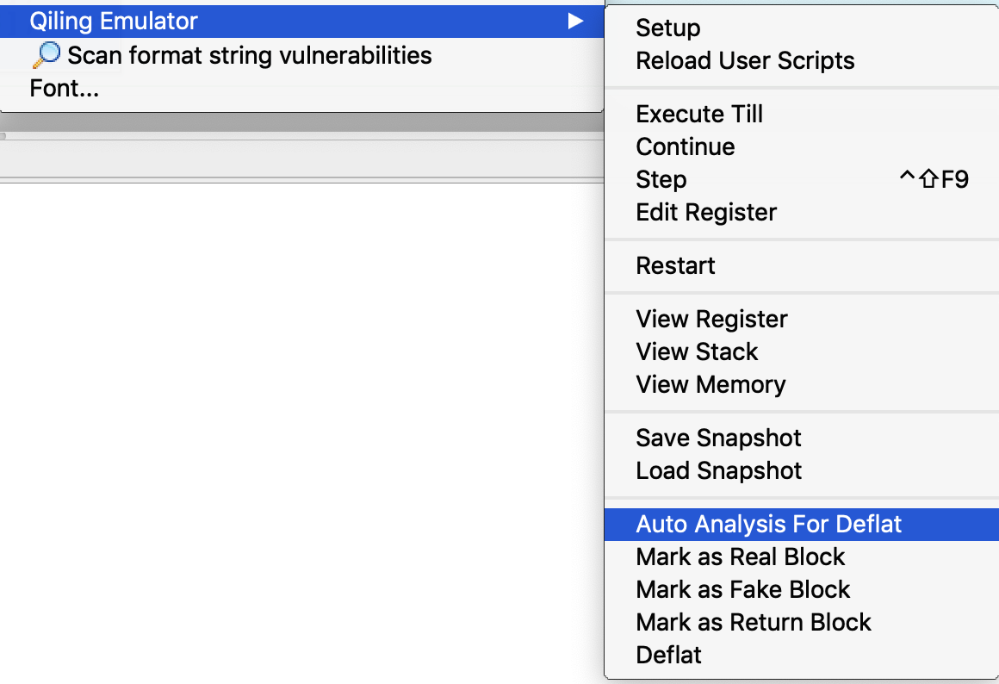
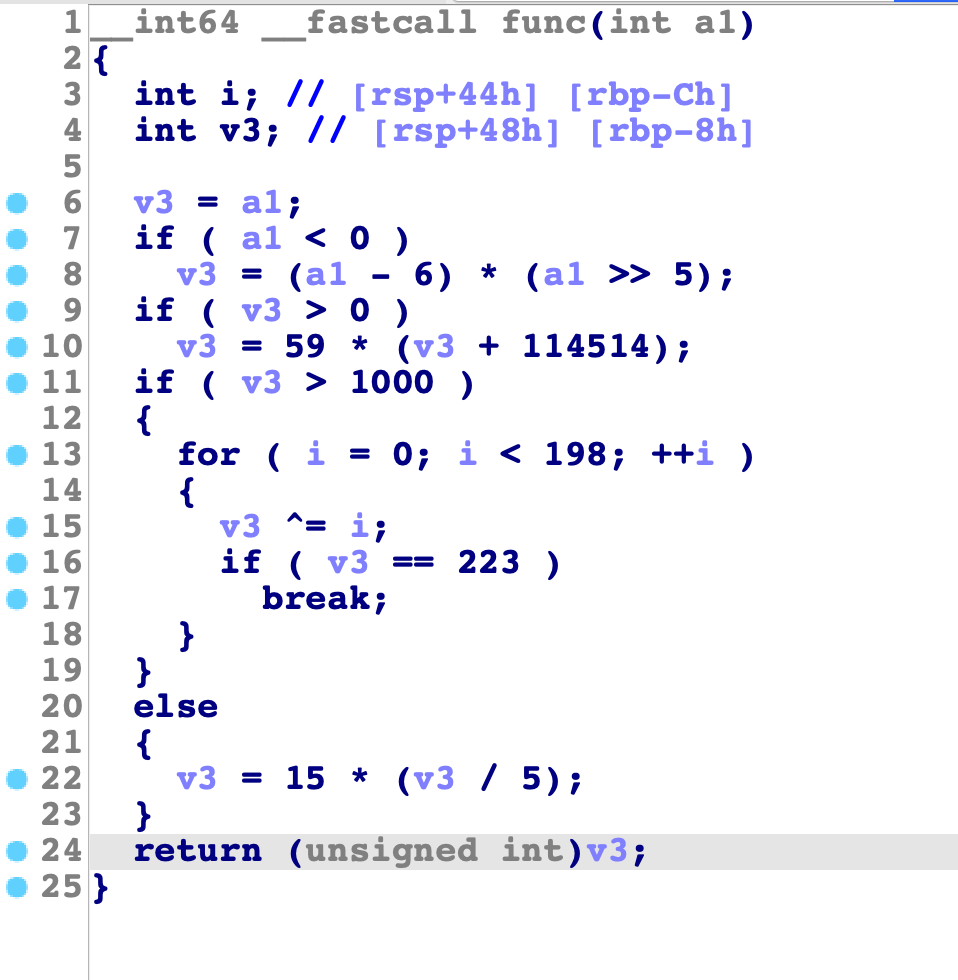

Qiling Emulator is a Plugin for IDA Pro. It provides a way to enable IDA and [Qiling](https://github.com/qilingframework/qiling) to interact. In this way, IDA can debug binaries for multiple platforms and architectures. 

With the customized script, it takes the plugin to a new higher. Imagine you can add hooks at various levels anywhere, dynamic hotpatch on-the-fly running code, even the loaded library, working with IDA Pro's powerful disassembly and decompile ability. How a fantastic thing! 

All of these can be achieved on one computer, no remote debug server, no virtual machine. 

### How it works?

Qiling Emulator deeply integrates the API of Qiling with the API of IDApython, and provides users with a friendly GUI interface to view registers, stack, and memory in real-time. Besides, customized script allows users to use all built-in functions of qiling.

### Support platform && architecture

| |8086|x86|x86-64|ARM|ARM64|MIPS|
|---|---|---|---|---|---|---|
| Windows (PE)    | -       | &#9745; | &#9745; | -       | &#9744; | -       |
| Linux (ELF)     | &#9744; | &#9745; | &#9745; | &#9745; | &#9745; | &#9745; |
| MacOS (MachO)   | -       | &#9744; | &#9745; | -       | &#9744; | -       |
| BSD (ELF)       | &#9744; | &#9744; | &#9745; | &#9744; | &#9744; | &#9744; |
| UEFI            | -       | &#9745; | &#9745; | -       | -       | -       |
| DOS (COM)       | &#9745; | -       | -       | -       | -       | -       |
| MBR             | &#9745; | -       | -       | -       | -       | -       |


### Demo video

Qiling's IDAPro Plugin: Instrument and Decrypt Mirai's Secret

[](https://www.youtube.com/watch?v=ZWMWTq2WTXk)

### Install

#### Install Qiling

Firstly, you need to install Qiling. See [Installation](/install/) for details.

#### Install IDA plugin

We provide two ways to install Qiling IDA plugin.

##### Use as a IDA plugin

- Edit the `qiling/extensions/idaplugin/qilingida.py` and switch `UseAsScript = True` to `UseAsScript = False`.
- Make a symbol link to your IDA plugins directory.

```bash
# Macos
ln -s /absolute/path/to/qiling/extensions/idaplugin/qilingida.py /Applications/<Your IDA>/ida.app/Contents/MacOS/plugins

# Windows
mklink C:\absolute\path\to\IDA\plugins\qilingida.py D:\absolute\path\to\qiling\extensions\idaplugin\qilingida.py
```

The advantage of symbol link is that you can always update the plugin by `git pull`. If you would not like a symbol link, you can also copy `qilingida.py` to your IDA plugin folder.

##### Use as a script file

- Edit the `qiling/extensions/idaplugin/qilingida.py` and switch `UseAsScript = False` to `UseAsScript = True`.
- Start IDA, Click `File/Script file...`, choose the `qilingida.py` and the plugin will be loaed.

Once loaded, the plugin is available under "Edit->Plugins->Qiling Emulator" and popup menu.

This plugin supports IDA7.x with Python3.6+.

Recommend platform: macOS && Linux

### Usage

After loading the plugin, right-click will show Qiling Emulator under the pop-up menu.



#### Emulate

**Must Click Setup First**

Select rootfs path and click Start (input custom script path if you have).

If the custom script is loaded successfully, it will prompt 'User Script Load'. Otherwise, it will prompt 'There Is No User Scripts', please check if the script path and syntax are correct.




Now if you click `Continue`, Qiling will emulate the target from start (entry_point) to finish (exit_point) and paint the path green.



If you want to start over, click `Restart`, it will clear the previous color and ask rootfs path again, then we are back to the start.

Now try something new, we want to let Qiling stop at 0x0804851E.


Just move the mouse pointer to position 0x0804851E and right-click, select `Execute Till`, Qiling will emulate to 0x0804851E(if the path is reachable), and paint the address node.


we can watch Register and Stack by clicking `View Register`, `View Stack`.


we can watch Memory by clicking `View Memory`.
Input address and size of memory you want to access.
It will show if this address can be accessed.


Click `Step` or use `CTRL+SHIFT+F9` to let Qiling emulator step in and paint the path blue. 

**You can see 'Register View' and 'Stack View' is in real-time**


Now we are in 0x0804852C. Let's enter the function sub_8048451 and press `F2` to set up a breakpoint at 0x08048454. 


Click `Continue`, it will emulate until the program exit or stop when a breakpoint is triggered and paint the path green.


Want to change some register values? Right-click on Disassemble View or Register View and select `Edit Register`, right-click on which register you want to change, then select `Edit Value` to change it.


#### Write custom scripts

custom scripts is a python script, the code frame like this:

```python
from qiling import *

class QILING_IDA():
    def __init__(self):
        pass

    def custom_prepare(self, ql):
        pass

    def custom_continue(self, ql:Qiling):
        hook = []
        return hook

    def custom_step(self, ql:Qiling):
        hook = []
        return hook
```

As the functions name means, you can code in a function and it will run when you click `Continue` or `Step`. So the cool thing is you can add your own hook. (if you code needn't use hook, keep `hook = []`)

To load custom script, please click Setup and input rootfs path and custom script path.

This is an example at qiling/extensions/idaplugin/examples/custom_script.py
```python
from qiling import *


class QILING_IDA():
    def __init__(self):
        pass

    def custom_prepare(self, ql):
        print('set something before ql.run')

    def custom_continue(self, ql:Qiling):
        def continue_hook(ql, addr, size):
            print(hex(addr))

        print('user continue hook')
        hook = []
        hook.append(ql.hook_code(continue_hook))
        return hook

    def custom_step(self, ql:Qiling, stepflag):
        def step_hook1(ql, addr, size, stepflag):
            if stepflag:
                stepflag = not stepflag
                print(hex(addr))

        def step_hook2(ql):
            print('arrive to 0x0804845B')

        print('user step hook')
        hook = []
        hook.append(ql.hook_code(step_hook1, user_data=stepflag))
        hook.append(ql.hook_address(step_hook2, 0x0804845B))
        return hook
```

Execute Till 0x08048452 and try to Step, custom_step hook will show.


Set breakpoint at 0x080484F6 and click `Continue`, custom_continue hook will show.


**Change the custom script to take effect immediately?**
Just save the script and click `Reload User Scripts`. If reload is succeeded, it will show 'User Script Reload'.

#### Save and Load Snapshot
you can save current status (Register, Memory, CPU Context) and load it to your Qiling emulate script or new Qiling Emulator Plugin, just click `Save Snapshot`
or `Load Snapshot`.

For saving, you should select the path where you want to store and file name.


For restoring, you should select where the status saving file is.


#### Ollvm De-flatten

[ollvm](https://github.com/obfuscator-llvm/obfuscator) is an obfuscator based on LLVM. One of its obfuscation is [Control Flow Flattening](https://github.com/obfuscator-llvm/obfuscator/wiki/Control-Flow-Flattening). With Qiling IDA plugin, you can de-flatten obfuscated binary easily.

Contro Flow Flattening will generate four types of blocks: real blocks, fake blocks, dispatcher blocks and return blocks.

- Real blocks: The real logic in your original program.
- Fake blocks: The fake logic in obfuscated code.
- Dispatcher blocks: Something like `switch...case...case...` implementation, decide the following control flows.
- Return blocks: The blocks which exit the function.

To deflat the function, our first task is to identity such blocks. Qiling IDA plugin will help you do some auto analysis by clicking `Auto Analysis For Deflat`. **Note that you should have set rootfs and custom script.**



After that, the blocks of the function will be rendered with different colors:

- Green: Real blocks.
- Blue: Dispatcher blocks.
- Gray: Fake blocks.
- Pink: Return blocks.
- Yellow: The first block.


In this stage, you can adjust the analysis result by marking the block as real, fake or return blocks.

If you attempt to decompile the code at this time, you will find it impossible to understand.


Then click `Deflat`, Qiling IDA plugin will start to perform symbolic execution to find the real control flow between real blocks and remove all fake blocks and dispatcher blocks. Below is the result:


Pressing F5 now presents you with clear logic without any obfuscation.


