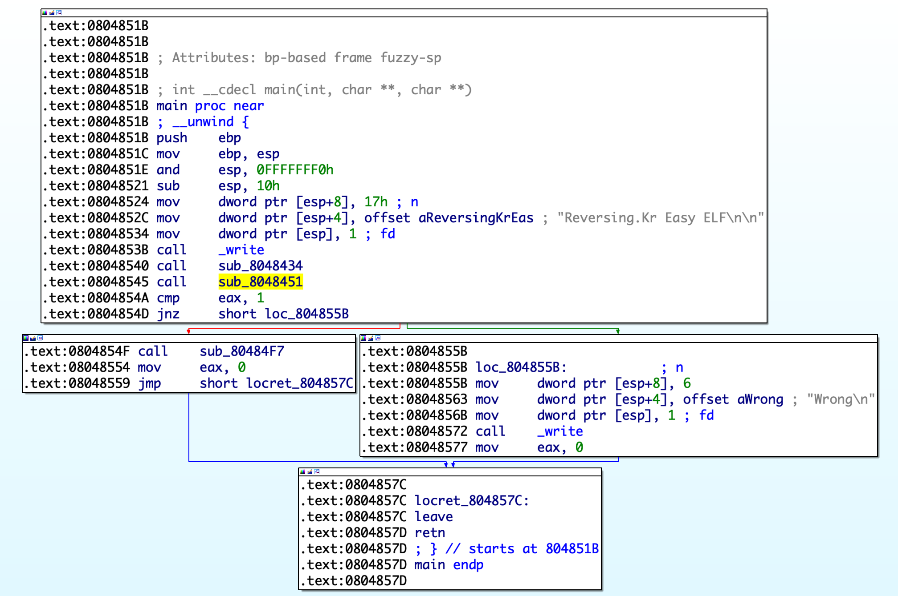
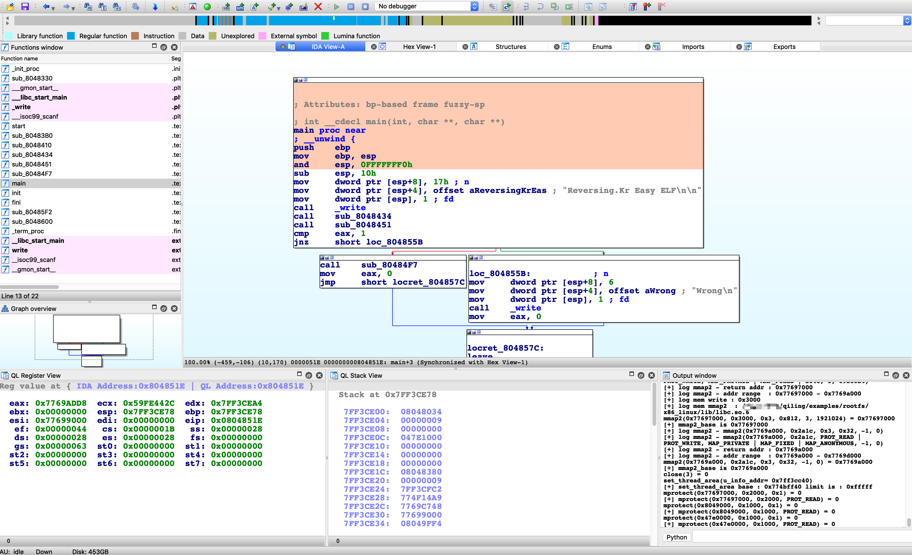
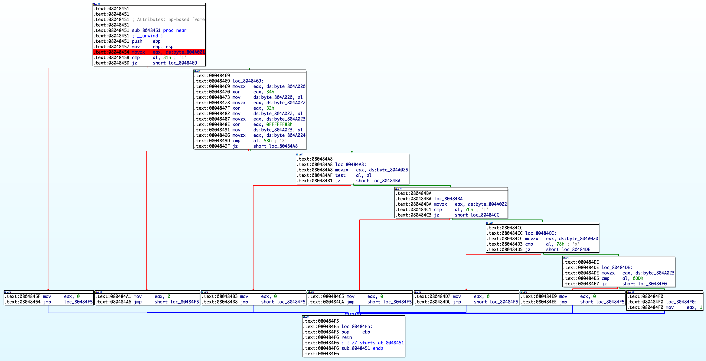
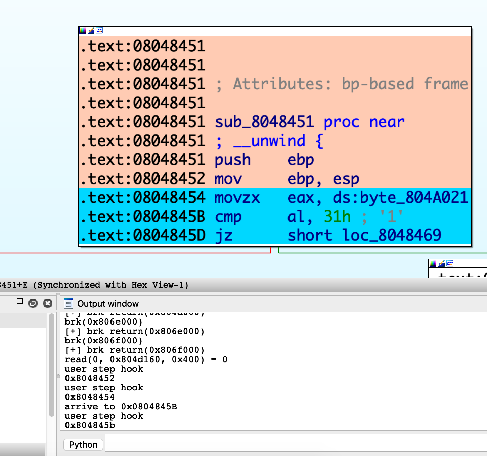
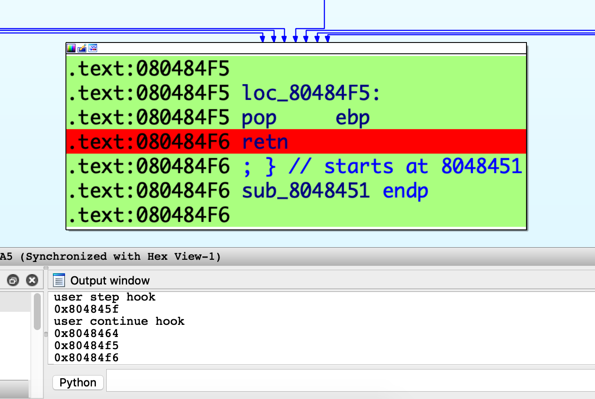
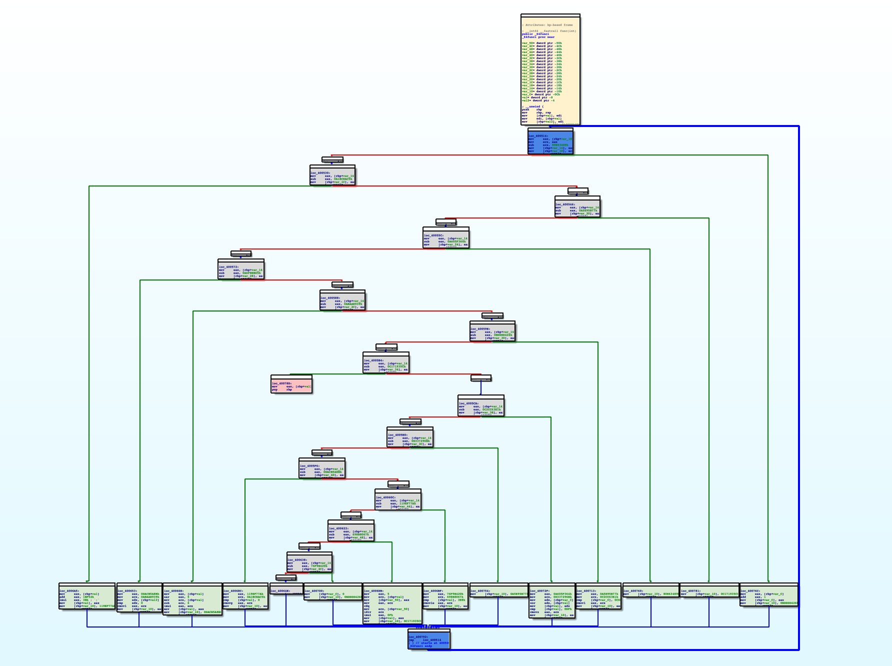

### Introduction

This a plugin for [IDA Pro](https://www.hex-rays.com/products/ida/). It enable IDA Pro and [Qiling](https://github.com/qilingframework/qiling) to interact with each other. In this way, IDA can debug, emulate and instrument binaries for multiple platforms and architectures from one single operation system.

With the customizable scripting ablity, it takes the plugin to higher level. Hooking codes and addresses, dynamic hotpatch on-the-fly, hijack loaded library, hijack syscall and other advanced API from Qiling Frame are able to perform within IDA Pro's powerful disassembly and decompile interface.

All of these can be achieved on one computer, no remote debug server or no virtual machine ever needed.

---

### Support platform && architecture

| |8086|x86|x86-64|ARM|ARM64|MIPS|
|---|---|---|---|---|---|---|
| Windows (PE)    | -       | &#9745; | &#9745; | -       | &#9744; | -       |
| Linux (ELF)     | -       | &#9745; | &#9745; | &#9745; | &#9745; | &#9745; |
| MacOS (MachO)   | -       | &#9744; | &#9745; | -       | &#9744; | -       |
| BSD (ELF)       | -       | &#9744; | &#9745; | &#9744; | &#9744; | &#9744; |
| UEFI            | -       | &#9745; | &#9745; | -       | -       | -       |
| DOS (COM)       | &#9745; | -       | -       | -       | -       | -       |
| MBR             | &#9745; | -       | -       | -       | -       | -       |

---

### Demo video

Lets look at the quick Qiling + IDA Pro Plugin Demo: Instrument and Decrypt Mirai's Secret

[](https://www.youtube.com/watch?v=ZWMWTq2WTXk)

---

### Usage

There are two method to use the plug-in
    - Load and Run
    - With Instrumentation Script
    
---

### Load and Run
- After loading the plugin, right-click will show Qiling Emulator under the pop-up menu.


- **Click Setup First**

- Select rootfs path and click Start (input custom script path if you have).

- If the custom script is loaded successfully, it will prompt 'User Script Load'. Otherwise, it will prompt 'There Is No User Scripts', please check if the script path and syntax are correct.


- Now click `Continue`, Qiling will emulate the target from start (entry_point) to finish (exit_point) and paint the path green.


- To start all over, click `Restart`, it will clear the previous color and ask rootfs path again, then we are back to the start.

- Now try something new, we want to let Qiling stop at 0x0804851E.



- Just move the mouse pointer to position 0x0804851E and right-click, select `Execute Till`, Qiling will emulate to 0x0804851E(if the path is reachable), and paint the address node.


- To watch Register and Stack, just by clicking `View Register`, `View Stack`.



- To watch Memory, click `View Memory` and input address and size of memory


- Click `Step` or use `CTRL+SHIFT+F9` to let Qiling step in and paint the path blue. 

- **You can see 'Register View' and 'Stack View' in real-time**


- In 0x0804852C. Let's enter the function sub_8048451 and press `F2` to set up a breakpoint at 0x08048454. 



- Click `Continue`, it will emulate until the program exit or stop when a breakpoint is triggered and paint the path green.


- How about update CPU register. Right-click on Disassemble View or Register View and select `Edit Register`, right-click on the register, then select `Edit Value` to change it.


---

### With Customized scripts

- Debug with instrumentation always required a user defined script, for example

```python
from qiling import *

class QILING_IDA():
    def __init__(self):
        pass

    def custom_prepare(self, ql):
        pass

    def custom_continue(self, ql:Qiling):
        hook = []
        return hook

    def custom_step(self, ql:Qiling):
        hook = []
        return hook
```

- custom_continue or custom_step simply means own implementation of `Continue` or `Step`. With this user able to add all the instrumentation API mentions in [Qiling Framework documents](https://docs.qiling.io) such as file system hijack, update memory or CPU register and all other advanced API from Qiling Framework.

- In order to load user customized script, please click Setup and input rootfs path and custom script path.

- This is an example at qiling/extensions/idaplugin/examples/custom_script.py

```python
from qiling import *


class QILING_IDA():
    def __init__(self):
        pass

    def custom_prepare(self, ql):
        print('set something before ql.run')

    def custom_continue(self, ql:Qiling):
        def continue_hook(ql, addr, size):
            print(hex(addr))

        print('user continue hook')
        hook = []
        hook.append(ql.hook_code(continue_hook))
        return hook

    def custom_step(self, ql:Qiling, stepflag):
        def step_hook1(ql, addr, size, stepflag):
            if stepflag:
                stepflag = not stepflag
                print(hex(addr))

        def step_hook2(ql):
            print('arrive to 0x0804845B')

        print('user step hook')
        hook = []
        hook.append(ql.hook_code(step_hook1, user_data=stepflag))
        hook.append(ql.hook_address(step_hook2, 0x0804845B))
        return hook
```

- Execute Till 0x08048452 and try to Step, custom_step hook will show.



- Set breakpoint at 0x080484F6 and click `Continue`, custom_continue hook will show.



**Change the custom script to take effect immediately?**
- Just save the script and click `Reload User Scripts`. If reload is succeeded, it will show 'User Script Reload'.

---

### Save and Load Snapshot
- User can save current excution state (That includes Register, Memory, CPU Context), by just clicking `Save Snapshot`
or `Load Snapshot`.

- For saving current state, should select the path to save the file is requred


- Screen shot below shows how to load the saved state and continue execution


---

### Ollvm De-flatten

[ollvm](https://github.com/obfuscator-llvm/obfuscator) is an obfuscator based on LLVM. One of its obfuscation is [Control Flow Flattening](https://github.com/obfuscator-llvm/obfuscator/wiki/Control-Flow-Flattening). With Qiling IDA plugin, Qiling and IDA Pro can de-flatten obfuscated binary easily.

- Contro Flow Flattening will generate four types of blocks: real blocks, fake blocks, dispatcher blocks and return blocks.

    - Real blocks: The real logic in original binary
    - Fake blocks: The fake logic in obfuscated code
    - Dispatcher blocks: Something like `switch...case...case...` implementation, decide the following control flows
    - Return blocks: The blocks which exit the function

- To deflat the function, first task is to identity such blocks. Qiling + IDA Pro plugin perform some level of auto analysis by clicking `Auto Analysis For Deflat`. **Note: by settings up the enviroment properly**


- After that, the blocks of the function will be rendered with different colors:

    - Green: Real blocks.
    - Blue: Dispatcher blocks.
    - Gray: Fake blocks.
    - Pink: Return blocks.
    - Yellow: The first block.



- In this stage, user able to adjust the analysis result by marking the block as real, fake or return blocks

- During this stage, decompile the binbary with human readble code is still not possible


- In order make the obfucated binary easier to understand, click `Deflat`, Qiling + IDA Pro plugin will start to find the real control flow between real blocks and remove all fake blocks and dispatcher blocks. Below is the result:


- Now by pressing F5 now show the deobfuscation decompiled code


---
### Additional Notes: Install Qiling

To install Qiling Framework. See The [Installation](https://docs.qiling.io/en/latest/install/) guide

---

###  Additional Notes: Install IDA plugin

There are  two ways to install Qiling + IDA Pro plugin

#### i. Use as a IDA plugin

- Make a symbol link to your IDA plugins directory.

```bash
# Macos
ln -s /absolute/path/to/qiling/extensions/idaplugin/qilingida.py /Applications/<Your IDA>/ida.app/Contents/MacOS/plugins

# Windows
mklink C:\absolute\path\to\IDA\plugins\qilingida.py D:\absolute\path\to\qiling\extensions\idaplugin\qilingida.py
```

The advantage of symbol link is user can always get the updated the plugin by just `git pull`. Copy `qilingida.py` to IDA Pro plugin folder will work too.

---

#### ii. Use as a script file

- Start IDA, Click `File/Script file...`, choose the `qilingida.py` and the plugin will be loaed.

Once loaded, the plugin is available under "Edit->Plugins->Qiling Emulator" and popup menu.

This plugin supports IDA7.x with Python3.6+.

Recommend platform: macOS && Linux
