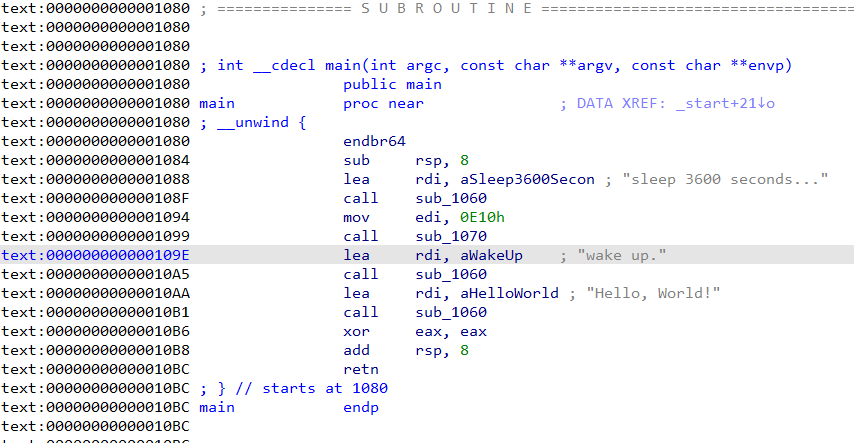

This example shows how Qiling able to skip "not required to run code" and just execute part of a binary.

- This is the C code, it will sleep for 3600 seconds before print helloworld
```c
#include <stdio.h>
#include <stdlib.h>
#include <unistd.h>
#include <string.h>

void func_hello()
{
    printf("Hello, World!\n");
    return;
}

int main(int argc, const char **argv)
{
    printf("sleep 3600 seconds...\n");
    sleep(3600);
    printf("wake up.\n");
    func_hello();
    return 0;
}
```
- Qiling's Partial Execution:
> - By doing a very minimum analysis, anything after 0x109e is free from sleep(3600)
> - So, ELF base address +  0x109e is the right address to start execution
> - During execution, it will by pass sleep(3600) and print "Hello Wolrd" right away



```python
from qiling import *

if __name__ == "__main__":
    ql = Qiling(["rootfs/x8664_linux/bin/sleep_hello"], "rootfs/x8664_linux", output= "default")
    X64BASE = int(ql.profile.get("OS64", "load_address"), 16)
    begin_point = X64BASE + 0x109e
    end_point = X64BASE + 0x10bc
    ql.run(begin = begin_point, end = end_point)
```

In any case or specifically fuzzer, Qiling do not have to run the entire binary. Just need to choose the right section, replicate the right context and memory segment will speedup the fuzzing speed.
